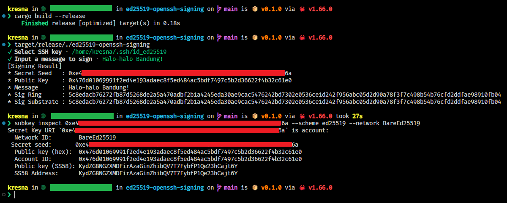

# Demo - Ed25519 OpenSSH Key for Message Signing

This is a demonstration repository for cryptographic message signing using OpenSSH Key, and to prove that both [ring](https://github.com/briansmith/ring/tree/b/0.16) & [sp-core](https://github.com/paritytech/substrate/tree/polkadot-v0.9.35) will have the same signature result.

## Example Result

